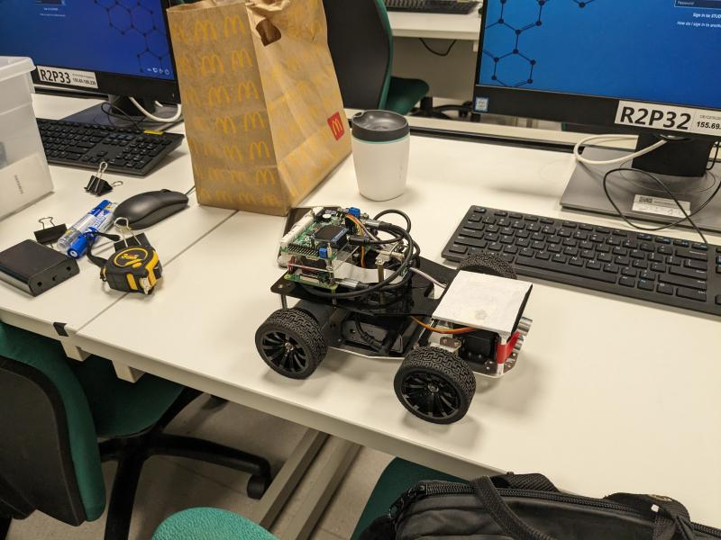
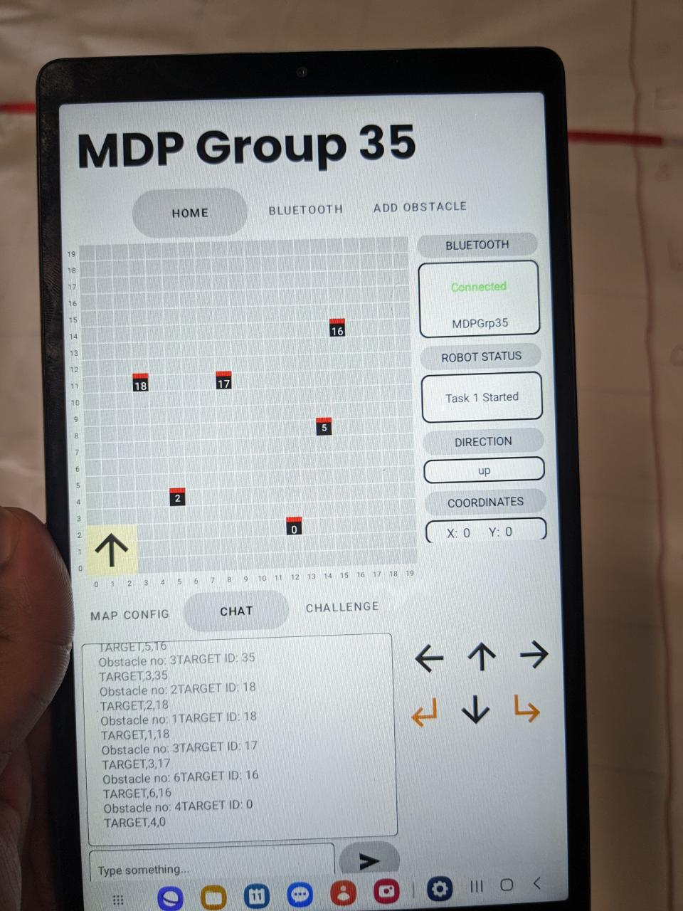
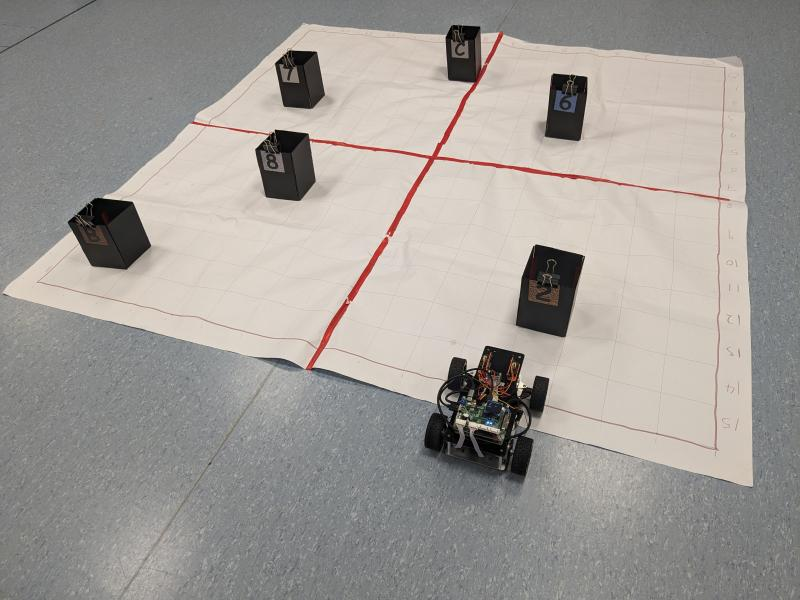

# Autonomous 4WD Edge AI Rover

An end-to-end **autonomous navigation system** built for a 4WD rover platform, powered by **real-time edge AI**, **SLAM**, and **mobile integration**. The project combines **computer vision**, **path planning**, and **embedded systems** to enable the rover to autonomously navigate complex environments.

By: Group 35, AY24-25 Semester 2

---

---

# Key Features

- **Raspberry Pi Edge AI**: Low-latency, multi-threaded inference system in Python & C++.
- **YOLOv5 Computer Vision**: High-speed symbol & arrow detection using PyTorch.
- **SLAM Integration**: Real-time mapping & localization using RTAB-Map / ORB-SLAM2 / GMapping.
- **Autonomous Navigation**: Robust pathfinding with A*, Dijkstra, and Hamiltonian heuristics.
- **Pre-mission AI Simulator**: Simulates millions of path permutations to reduce real-time compute.
- **Android Interface**: Live telemetry, mission visualization, and manual control override.
- **Modular Architecture**: Built with ROS nodes, Docker containers, and reusable planning modules.

---

# Task Descriptions

## Task 1: Grid Navigation & Symbol Detection

- Arena: 2m × 2m grid
- Obstacles: 4–8 blocks with symbol cards (10cm × 10cm × 20cm)
- Objective: Navigate to each obstacle, detect the symbol, and complete the mission in minimum time.
- Challenge: Fast visual detection, dynamic path planning, and collision-free motion.

## Task 2: Sequential Symbol-Guided Navigation

- Starting from a car park
- Each obstacle has a **left/right arrow symbol**
- Follow the directional trail until all goal points are visited
- Return to car park and halt
- Penalty: +10 seconds per collision

---

# Simulation
In order to run simulation, navigate to project directory.

# Required files
We used Python 3.12.8 in our simulation. 
Install the required files with "pip install -r requirements.txt"

Run "py main.py" once done.

# Credits
Forked from https://github.com/sssstf0rest/SC2079-MDP-Grp2, and improved on it.

Android component cloned from https://github.com/Pante/SC2079/tree/master/android/mdp_group_14 - with fixes and new features.
